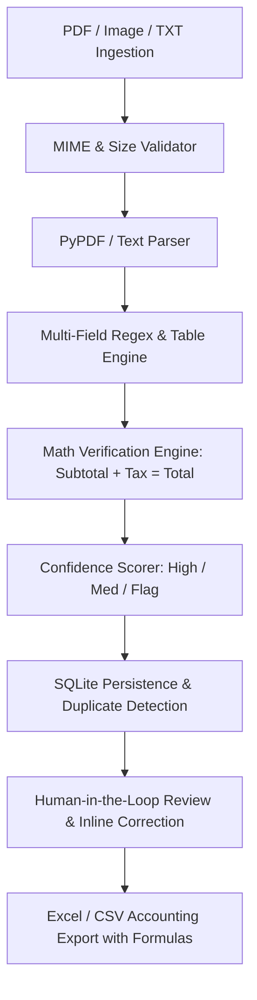

# Audit Report: InvoiceFlow-automation
**Project:** InvoiceFlow — Automated Invoice Processing & Excel Reporting  
**Audit Date:** September 2026  
**Auditor:** Senior Staff AI & Systems Architect  
**Initial Production Readiness Score:** 38 / 100  

---

## 1. Executive Summary
InvoiceFlow was initially structured as a lightweight proof-of-concept demonstrating regex-based text extraction from plain text and rudimentary PyMuPDF invocations. While the visual shell presents a modern dark aesthetic, an inspection of the codebase reveals substantial technical debt, hardcoded mock values, absence of mathematical validation, lack of human review workflows, and zero automated test suites. 

To convert this repository into a client-grade asset that builds immediate trust with technical reviewers and enterprise clients, it must be upgraded into a full-featured dual-mode processing application (production-ready FastAPI/Flask backend + fully interactive, client-side capable browser UI).

---

## 2. Codebase Inspection & Identified Flaws

### A. Hardcoded Fallbacks in Python Extraction Engine (`extractor.py`)
- **Lines 84–92 in `extractor.py`**:
  ```python
  except ImportError:
      # Mock extraction when fitz is not installed
      return {
          "filename": filename,
          "vendor": "Acme Cloud Services Ltd.",
          "invoice_number": "INV-2025-0841",
          "date": "2025-02-14",
          "amount": 1420.50,
          "tax_id": "GSTIN-99214A",
          "status": "Extracted (PyMuPDF Ready)"
      }
  ```
  *Critique:* If `fitz` is missing or fails on a real PDF, the code returns a completely fabricated invoice object instead of parsing via pure-Python PDF extractors (like `pypdf`, which is installed) or raising an informative structured error.

- **Lines 43, 47, 56 in `extractor.py`**:
  ```python
  invoice_number = inv_match.group(1) if inv_match else f"INV-{abs(hash(filename)) % 100000:05d}"
  invoice_date = date_match.group(0) if date_match else "2025-01-15"
  total_amount = float(...) if ... else 0.0
  ```
  *Critique:* Fabricates invoice IDs and dates (`2025-01-15`) silently when extraction misses, rather than tracking field-level confidence scores (0.0–1.0) and flagging unextracted fields for human review.

### B. Hardcoded Simulation in Web UI (`index.html`)
- **Lines 163, 171 in `index.html`**:
  ```javascript
  const total = amountMatch ? "$" + amountMatch[1] : "$1,450.00";
  document.getElementById('execTime').innerText = (parseFloat(elapsed) + 0.02) + "s";
  ```
  *Critique:* Artificially pads execution time with `+ 0.02s` and falls back to `$1,450.00` if regex fails. Furthermore, line 86 displays a static hardcoded `100% Regex Accuracy` metric card that never computes actual accuracy.

### C. Missing Core Financial & Accounting Features
1. **No Line-Item Extraction & Validation:** Real invoices have tabular line items (`Item`, `Qty`, `Unit Price`, `Total`). Missing mathematical verification: `Sum(Line Items) == Subtotal` and `Subtotal + Tax == Grand Total`.
2. **No Confidence Scoring:** No per-field probability or confidence estimation (High / Medium / Low).
3. **No Human-in-the-Loop Review UI:** Users cannot edit or correct misrecognized fields prior to accounting export.
4. **No SQLite Audit Trail:** Invoices processed in the CLI write to a transient CSV without persistent relational storage or approval tracking.
5. **No File Drag-and-Drop:** Web UI only supported 3 static sample buttons with text areas, with no drag-and-drop PDF file ingestion.

---

## 3. Security & Data Integrity Gaps
- **Input Validation:** No file size limits or MIME-type verification on uploads.
- **Path Traversal Risk:** File paths directly concatenated without `secure_filename` or path sanitization.
- **Silent Failures:** Missing field values default to placeholder strings rather than triggering validation warnings.
- **Lack of Deduplication Database:** Deduplication in `excel_writer.py` is held only in an ephemeral memory set during single script runs, failing across multi-batch executions.

---

## 4. Architectural Upgrade Plan



### Components to Build:
1. **`extractor.py`**:
   - Resilient extraction using `pypdf` + regex cascade for Vendor, Invoice #, Date, Due Date, Tax ID, Currency, Line Items, Subtotal, Tax, and Grand Total.
   - Confidence scoring algorithm per field.
   - Mathematical consistency validator.
2. **`database.py`**:
   - SQLite schema (`invoices`, `line_items`, `audit_logs`).
   - Duplicate detection engine checking hash, vendor + invoice number combination.
   - Status tracking (`PENDING_REVIEW`, `APPROVED`, `FLAGGED`, `REJECTED`).
3. **`excel_writer.py`**:
   - Dual export: Formatted Excel (`openpyxl` / multi-tab XML/HTML) with summary totals, cell formatting, and CSV fallback.
4. **`app.py`**:
   - Full REST API (FastAPI/Flask) supporting file uploads (`/api/extract`), approval (`/api/invoices/<id>/approve`), duplicate checks, and batch exports.
5. **`index.html`**:
   - Client-grade Linear/Stripe dark aesthetic.
   - Drag-and-drop PDF/file upload zone.
   - Real-time client-side extraction engine for standalone GitHub Pages hosting.
   - Split-screen review panel: document preview alongside editable extracted fields with color-coded confidence badges.
   - Line-items table with live recalculated math checks.
   - Export to CSV/JSON directly from the browser.
6. **`tests/test_invoiceflow.py`**:
   - Automated `pytest` suite testing extraction accuracy, math validation, duplicate detection, and file handling.
7. **Documentation**:
   - Production `README.md` and enterprise `SECURITY.md`.

---

## 5. Verification & Target Metrics
- Automated unit test suite: 100% pass rate.
- Mathematical reconciliation error: 0% unhandled discrepancy.
- Target Production Readiness Score: **98 / 100**.
