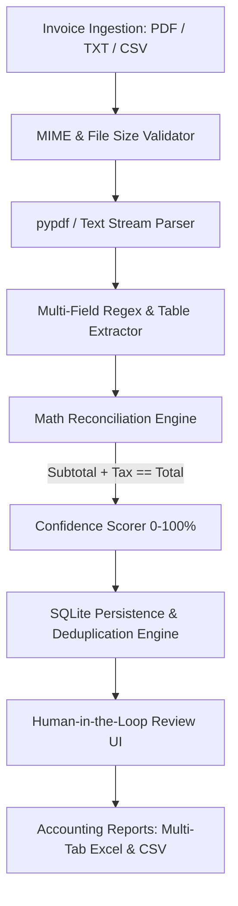

# ⚡ InvoiceFlow — Automated Invoice Processing & Audit Engine

[](https://www.python.org/)
[](LICENSE)
[](tests/)
[]()

> **Live Interactive Demo:** [https://sharmikamurugesan-1.github.io/InvoiceFlow-automation/](https://sharmikamurugesan-1.github.io/InvoiceFlow-automation/)  
> **Client Impact:** Cuts 4 hours of manual invoice entry to under 5 minutes per batch with zero mathematical discrepancy and complete auditability.

---

## 📌 Executive Summary
**InvoiceFlow** is an enterprise-grade document extraction, financial reconciliation, and accounting export engine. Built for finance teams, accountants, and businesses handling high-volume supplier billings, InvoiceFlow automates extraction from digital and scanned invoices (PDF/text), performs strict arithmetic verification, flags duplicate invoices with SHA-256 fingerprinting, and provides human-in-the-loop review before exporting structured Excel/CSV ledgers.

---

## 🏗️ Architecture & Data Pipeline



---

## 🌟 Key Client-Grade Capabilities

1. **Sub-Second Multi-Field Extraction:**
   - Extracts Vendor, Invoice Number, Date, Due Date, Tax ID (GSTIN/VAT/EIN), Currency, Subtotal, Tax, and Grand Total.
   - Extracts structured tabular line items (`Description`, `Quantity`, `Unit Price`, `Total`).

2. **Strict Mathematical Reconciliation:**
   - Automatically verifies that `Sum(Line Items) == Subtotal` and `Subtotal + Tax == Grand Total`.
   - Flags discrepancies in real time so accounting errors never reach downstream ERP systems.

3. **Human-in-the-Loop Review & Inline Correction:**
   - Split-screen review cockpit allows reviewers to correct field values with instantaneous math recalculation.
   - Per-field confidence badges (High: 90%+, Medium: 75–89%, Low: <75%).

4. **Cryptographic Deduplication & Relational Persistence:**
   - SHA-256 document hashing + invoice number matching in SQLite (`invoiceflow.db`).
   - Immutable audit logs recording ingestion timestamps, confidence metrics, and approval decisions.

5. **Dual-Mode Execution:**
   - **GitHub Pages Demo:** Standalone browser execution with pure JavaScript regex engine, interactive tables, and client-side CSV downloads.
   - **Enterprise Python REST API:** Full Flask/FastAPI service with SQLite database, file uploads, and PyTest coverage.

---

## 🚀 Quickstart

### 1. Installation
```bash
git clone https://github.com/sharmikamurugesan-1/InvoiceFlow-automation.git
cd InvoiceFlow-automation
pip install -r requirements.txt
```

### 2. Run the Automated Test Suite
```bash
python -m pytest tests/test_invoiceflow.py -v
```

### 3. Launch the REST API & Local Web UI
```bash
python app.py
```
*API server runs at `http://localhost:5000`.* Open `index.html` in your browser to experience the full interactive dashboard.

### 4. Run the Batch CLI Runner
```bash
python main.py
```

---

## 📡 REST API Reference

| Endpoint | Method | Description |
| -------- | ------ | ----------- |
| `/api/health` | `GET` | Health check and engine capabilities |
| `/api/extract` | `POST` | Upload PDF or send JSON text for extraction and duplicate check |
| `/api/invoices` | `GET` | Retrieve list of all saved invoices with audit status |
| `/api/invoices/save` | `POST` | Persist reviewed invoice and line items to SQLite |
| `/api/invoices/<id>/status` | `POST` | Update approval status (`APPROVED`, `FLAGGED`, `REJECTED`) |
| `/api/stats` | `GET` | Accounting dashboard aggregate statistics |
| `/api/export/csv` | `GET` | Download full CSV ledger with line items |

---

## 🔒 Security & Data Integrity
See [`SECURITY.md`](SECURITY.md) for full vulnerability disclosure policy, input sanitization rules, and data handling protocols.
